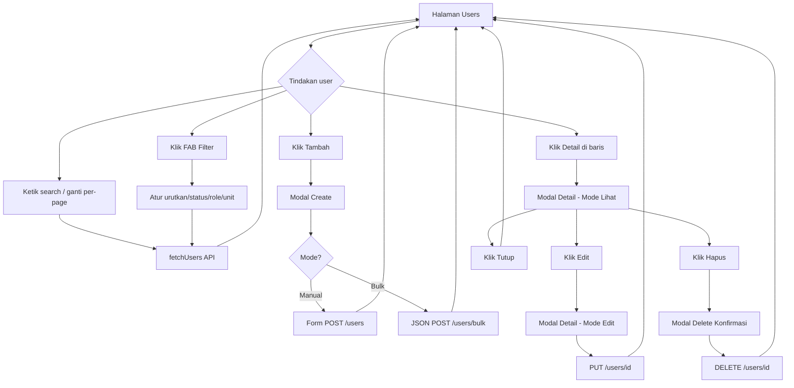
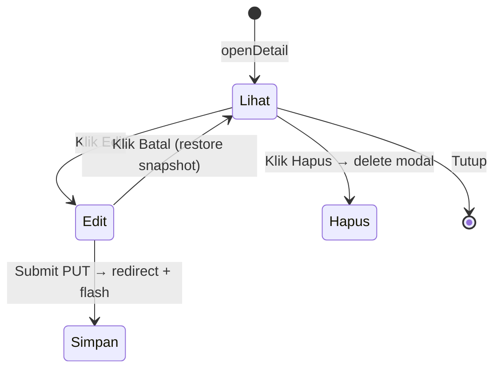

# Design Document — Master Data / Admin Users

Dokumen ini mendeskripsikan pola desain UI/UX, struktur halaman, alur interaksi, dan kontrak data halaman **Manajemen Pengguna** (`/masterdata/admin/users`). Gunakan sebagai referensi standar saat membangun halaman master data serupa (roles, units, courses, dll).

**Stack:** Laravel Blade + Alpine.js 3 + Tailwind CSS 4 + Font Awesome  
**Layout:** `resources/views/layouts/app.blade.php`  
**Akses:** Role `ADM` / `Administrator` only

---

## 1. Filosofi Desain

### Prinsip utama

| Prinsip | Implementasi |
|---------|--------------|
| **Satu aksi di tabel** | Kolom aksi hanya tombol **Detail** — tidak ada Edit/Hapus langsung di baris |
| **Detail sebagai hub** | Semua operasi ubah/hapus dilakukan dari modal Detail |
| **Halaman ringan** | Data tabel dimuat via AJAX; tidak full page reload saat filter/pagination |
| **Modal terpusat** | Semua modal di-`x-teleport` ke `#modal-root` di layout app |
| **Progressive disclosure** | Filter lanjutan disembunyikan di FAB; bar atas hanya search + per-page |
| **Section card** | Form/modal dibagi section dengan header ikon + border card |

### Pola yang TIDAK dipakai

- Tombol Edit / Hapus di setiap baris tabel
- Halaman terpisah untuk create/edit (`users/create`, `users/{id}/edit` ada di route tapi UI tidak menggunakannya)
- Filter semua di bar atas (membuat bar terlalu penuh)

---

## 2. Struktur Halaman

```
┌─────────────────────────────────────────────────────────────┐
│ HEADER                                                      │
│  Title + Breadcrumb                    [+ Tambah]           │
├─────────────────────────────────────────────────────────────┤
│ ALERT (flash success/error, auto-hide 4s)                   │
├─────────────────────────────────────────────────────────────┤
│ TOOLBAR                                                     │
│  [🔍 Search ........................] [Tampilkan ▼ 50]      │
├─────────────────────────────────────────────────────────────┤
│ TABLE                                                       │
│  Info User | Role | Unit Utama | Status | Aksi (Detail)     │
├─────────────────────────────────────────────────────────────┤
│ PAGINATION                                                  │
│  Menampilkan X–Y dari Z data          [Prev] [Next]         │
└─────────────────────────────────────────────────────────────┘

                                    ┌──────────────┐  ← FAB Filter (fixed)
                                    │ Filter panel │
                                    └──────────────┘
                                         ( ● )      ← dot merah jika filter aktif
```

### File terkait

| File | Peran |
|------|-------|
| `resources/views/admin/users.blade.php` | Halaman utama, Alpine `usersApp()` |
| `resources/views/admin/modal-create.blade.php` | Modal tambah (Manual / Bulk) |
| `resources/views/admin/modal-detail.blade.php` | Modal detail + edit inline |
| `resources/views/admin/delete-modal.blade.php` | Konfirmasi hapus |
| `app/Http/Controllers/AdminController.php` | Backend CRUD + API data |

---

## 3. Header

**Komponen:**
- Judul: `Manajemen Pengguna` + ikon `fa-users` (indigo)
- Breadcrumb: `Master Data / Users`
- Tombol kanan: **Tambah** (indigo solid, `fa-plus`)

**Interaksi:**
- Klik **Tambah** → dispatch event `open-create-modal` → buka modal create

```js
window.dispatchEvent(new CustomEvent('open-create-modal', { bubbles: true }))
```

---

## 4. Toolbar (Bar Atas)

### Search
- Input full-width dengan ikon search kiri
- Debounce 400ms → `fetchUsers()`
- Mencari: nama, email, ID user, unit, role

### Per Page (bukan filter FAB)
- Label: `Tampilkan` (hidden di mobile)
- Opsi: `10 | 25 | 50 | 100 | 150 | 250`
- Default: `50`
- Ganti nilai → reload halaman 1

> **Catatan desain:** Kontrol jumlah data per halaman ditempatkan di bar atas karena sering dipakai. Filter kualitatif (urutkan, status, role, unit) masuk FAB.

---

## 5. Tabel Data

### Kolom

| Kolom | Konten | Styling |
|-------|--------|---------|
| **Info User** | Avatar inisial (lingkaran biru) + nama + email | Avatar `w-10 h-10 rounded-full` |
| **Role** | Badge per role | `rounded-full bg-blue-50 text-blue-700` |
| **Unit Utama** | Kode unit (truncate, tooltip nama) | `bg-indigo-50 font-mono` |
| **Status** | Pill Aktif / Nonaktif | Hijau / merah dengan dot |
| **Aksi** | **Hanya tombol Detail** | `bg-blue-50` + ikon `fa-eye` |

### State tabel

| State | Tampilan |
|-------|----------|
| Loading | Spinner `fa-circle-notch fa-spin`, colspan 5 |
| Kosong | Ikon `fa-users` + "User tidak ditemukan" |
| Data | Baris hover `hover:bg-gray-50` |

### Tombol Aksi — Detail saja

```html
<button @click="openDetail(user)">
  <i class="fa-eye"></i> Detail
</button>
```

**Alasan:** Mengurangi clutter di tabel; user masuk ke konteks lengkap sebelum edit/hapus.

---

## 6. Pagination

- Teks: `Menampilkan {from} – {to} dari {total} data`
- Tombol: **Prev** (gray) / **Next** (indigo)
- Disabled saat tidak ada halaman sebelumnya/sesudahnya
- Ganti halaman → scroll ke atas smooth

---

## 7. FAB Filter (Floating Action Button)

**Posisi:** Fixed kanan bawah (`bottom: 1.5rem; right: 1.5rem`)  
**Teleport:** `body` via `x-teleport`  
**Ikon:** `fa-sliders` (tutup: `fa-xmark`)

### Indikator aktif
- Titik merah kecil di pojok kanan atas **ikon** (bukan di tengah tombol)
- Muncul jika ada filter non-default aktif
- Tooltip: `{n} filter aktif`

### Panel filter (popover di atas FAB)

| Field | Opsi | Default |
|-------|------|---------|
| **Urutkan** | Terbaru, Terlama, A-Z, Z-A | Terbaru |
| **Status Akun** | Semua, Aktif, Nonaktif | Semua |
| **Role** | Semua + daftar role | Semua |
| **Unit** | Semua + daftar unit | Semua |

**Header panel:** Judul "Filter" + tombol **Reset** (merah, uppercase kecil)  
**Reset:** Mengembalikan urutkan ke Terbaru + kosongkan status/role/unit → `fetchUsers(1)`

### Perhitungan filter aktif (`activeFilterCount`)

```
+1 jika sort ≠ 'newest'
+1 jika status terisi
+1 jika role terisi
+1 jika unit terisi
```

---

## 8. Alur Utama (User Flow)



---

## 9. Modal Create (`modal-create.blade.php`)

**Trigger:** Event `open-create-modal`  
**Ukuran:** `max-w-4xl`, `max-h-[90dvh]`  
**Struktur:** Header sticky → Tab mode → Body scroll → Footer sticky

### Tab mode

| Tab | Deskripsi |
|-----|-----------|
| **Manual** | Form HTML POST klasik |
| **Bulk** | Import via textarea / CSV / Excel |

### Section Manual (berurutan)

1. **Informasi Dasar** — nama*, email*, NIM/NIP/NIK, tipe pengguna*
2. **Kata Sandi Akun** — password*, konfirmasi*
3. **Penempatan Unit Utama** — tingkat (kampus/fakultas/prodi) + picker dinamis
4. **Unit Tambahan / Rangkap** — opsional; hidden untuk mahasiswa & tingkat kampus
5. **Hak Akses / Role** — checkbox; mahasiswa otomatis role MHS
6. **Status Akun** — toggle aktif (default: on)

**Footer Manual:** `[Batal]` `[Simpan]` — submit menutup modal lalu POST

### Section Bulk

1. **Pengaturan Batch** — tipe user, tingkat unit, unit utama
2. **Role** — checkbox (kecuali mahasiswa = auto)
3. **Input Bulk** — textarea + upload CSV/Excel + download template
4. **Status** — toggle aktif
5. **Hasil import** — counter sukses/gagal + tabel log error

**Format bulk:**
- Mahasiswa: `nama nim` (bebas/spasi) — email auto `{nim}@mhs.uinsaizu.ac.id`, password = NIM
- Staff: `Nama NIP Email` per baris — password = NIP

**Footer Bulk:** `[Batal]` `[Simpan]` — fetch JSON, tidak reload penuh

---

## 10. Modal Detail (`modal-detail.blade.php`)

**Trigger:** Event `open-detail-modal` dengan payload:

```js
{
  url: update_url,        // PUT endpoint
  deleteUrl: delete_url,
  userName: string,
  canDelete: boolean,
  userData: {
    id, name, email, identity, type,
    unit, tingkatUtama, active,
    roles: [], unitTambahan: []
  }
}
```

### Dua mode dalam satu modal



### Mode Lihat (readonly)

| Section | Field |
|---------|-------|
| **Informasi Dasar** | ID User, Nama, Email, NIM/NIP/NIK, Tipe, Status |
| **Unit Kerja** | Tingkat unit, Unit utama (kode + nama), Unit tambahan (chips) |
| **Hak Akses / Role** | Badge per role |

### Mode Edit

Field sama seperti modal Create (tanpa section password), plus:
- Toggle status akun
- Role checkbox dengan lock untuk admin utama (`ADM-UIN-0000001`)
- Unit tambahan dengan checkbox dinamis

### Footer — Mode Lihat

| Kiri | Kanan |
|------|-------|
| **Tutup** (gray) | **Hapus** (red, jika `canDelete`) + **Edit** (blue) |

### Footer — Mode Edit

| Kiri | Kanan |
|------|-------|
| **Batal** (gray, restore snapshot) | **Simpan** (blue, submit PUT) |

### Aturan bisnis di UI

- Mahasiswa → role otomatis MHS, unit tambahan dikunci kosong
- Admin utama → checkbox role Administrator disabled
- `canDelete = false` → tombol Hapus disembunyikan

---

## 11. Modal Delete (`delete-modal.blade.php`)

**Trigger:** Event `open-delete-modal` dari modal detail  
**Ukuran:** `max-w-md` (lebih kecil dari create/detail)  
**Header:** Ikon peringatan merah + "Konfirmasi Hapus" + nama user  
**Body:** Teks konfirmasi tidak bisa dibatalkan  
**Aksi:** `[Batal]` `[Hapus]` — form DELETE ke `deleteUrl`

> Modal detail ditutup saat membuka delete modal agar tidak overlap.

---

## 12. Sistem Modal (Teknis)

### Teleport ke `#modal-root`

Semua modal menggunakan:

```html
<template x-teleport="#modal-root">
  <div class="app-modal-overlay fixed inset-0 ...">
```

**Layout app** menyediakan:

```html
<div id="modal-root"></div>
```

CSS: `z-index: 10000000`, `pointer-events: none` pada root, `auto` pada child.

### Anatomi modal standar

```
┌─────────────────────────────────────┐
│ HEADER (sticky top)                 │
│  [ikon box] Judul + subtitle        │
├─────────────────────────────────────┤
│ BODY (flex-1 overflow-y-auto)       │
│  ┌─ Section Card ─────────────────┐ │
│  │ Section title + icon           │ │
│  │ Fields...                      │ │
│  └────────────────────────────────┘ │
├─────────────────────────────────────┤
│ FOOTER (sticky bottom, backdrop)    │
│  [Secondary kiri]    [Primary kanan]│
└─────────────────────────────────────┘
```

### Komunikasi antar komponen (Custom Events)

| Event | Emitter | Listener |
|-------|---------|----------|
| `open-create-modal` | Tombol Tambah | `modal-create` |
| `open-detail-modal` | Tombol Detail | `modal-detail` |
| `open-delete-modal` | Tombol Hapus di detail | `delete-modal` |
| `users-bulk-imported` | Bulk import selesai | `usersApp` (refresh + alert) |

---

## 13. Design Tokens & Styling

### Warna aksen

| Token | Tailwind | Pemakaian |
|-------|----------|-----------|
| Primary | `indigo-600` | CTA utama, FAB, pagination Next |
| Info / Detail | `blue-600` / `blue-50` | Tombol Detail, badge role |
| Success | `green-50` / `green-700` | Status aktif, alert sukses |
| Danger | `red-600` | Hapus, alert error, Reset filter |
| Surface | `white` / `gray-800` | Card, tabel (dark mode) |
| Modal bg | `slate-50` / `#0f172a` | Body modal |

### Border radius

| Elemen | Class |
|--------|-------|
| Card / input / modal | `rounded-xl` |
| Modal container | `rounded-2xl` |
| Badge / pill | `rounded-full` |
| FAB | `rounded-full` (h-14 w-14) |

### Tipografi label form

```html
class="text-[10px] font-bold uppercase tracking-widest text-gray-400"
```

### Section card

```html
class="rounded-xl border border-gray-200 bg-white shadow-sm dark:border-gray-700 dark:bg-[#1e293b]"
```

Header section: `border-b` + ikon Font Awesome berwarna `indigo-500`

### Tombol

| Varian | Style |
|--------|-------|
| Primary | `bg-blue-600` atau `bg-indigo-600`, `rounded-xl`, `font-bold` |
| Secondary | `bg-gray-200`, dark: `bg-gray-700` |
| Danger | `bg-red-600` + `shadow-red-600/20` |
| Table action | `bg-blue-50 border border-blue-200 text-xs font-bold` |

---

## 14. API Data (AJAX)

**Endpoint:** `GET /masterdata/admin/users/api/data`

| Param | Tipe | Default | Keterangan |
|-------|------|---------|------------|
| `page` | int | 1 | Halaman pagination |
| `per_page` | int | 50 | 10, 25, 50, 100, 150, 250 |
| `search` | string | — | Full-text filter |
| `sort` | string | `newest` | `oldest`, `name_asc`, `name_desc` |
| `status` | `0\|1` | — | Filter status akun |
| `role` | int | — | ID role |
| `unit` | string | — | ID unit |

**Response:** Laravel pagination JSON (`data`, `current_page`, `from`, `to`, `total`, `prev_page_url`, `next_page_url`)

**Item user (ringkasan):**

```json
{
  "id": "DSN-ARS-0000001",
  "name": "...",
  "email": "...",
  "identity_id": "...",
  "user_type": "DSN",
  "unit_id": "ARS",
  "unit_name": "...",
  "is_active": "1",
  "initial": "D",
  "roles": [{ "id": 5, "role_name": "Dosen" }],
  "role_ids": [5],
  "unit_tambahan": [],
  "tingkat_utama": "prodi",
  "update_url": "...",
  "delete_url": "...",
  "can_delete": true,
  "is_primary_admin": false
}
```

---

## 15. Alert & Feedback

| Sumber | Mekanisme |
|--------|-----------|
| Redirect CRUD (create/update/delete) | Session flash → `initData()` → Alpine alert 4 detik |
| Bulk import | Custom event → `handleBulkImported()` → alert + refresh tabel |
| Error validasi bulk | Alert browser + log di modal |

**Komponen alert:**

```
border-l-4 + bg-green-50 (sukses) / bg-red-50 (error)
ikon fa-check-circle / fa-circle-xmark
```

---

## 16. Checklist Replikasi ke Halaman Lain

Saat membangun halaman master data baru, ikuti pola ini:

- [ ] Extends `layouts.app`
- [ ] Satu root Alpine component (`x-data`, `x-init`)
- [ ] Header: judul + breadcrumb + 1 CTA utama
- [ ] Toolbar: search + per-page (opsional)
- [ ] Tabel AJAX dengan loading/empty state
- [ ] Kolom aksi: **hanya Detail** (atau satu aksi primer)
- [ ] Pagination Prev/Next + teks range
- [ ] FAB filter untuk filter sekunder
- [ ] Modal create terpisah (`modal-create.blade.php`)
- [ ] Modal detail view/edit terpisah (`modal-detail.blade.php`)
- [ ] Modal delete konfirmasi terpisah (`delete-modal.blade.php`)
- [ ] Semua modal `x-teleport="#modal-root"`
- [ ] Komunikasi via `CustomEvent` (bukan prop drilling)
- [ ] Section card konsisten di dalam modal
- [ ] Footer modal: secondary kiri, primary kanan

---

## 17. Changelog

| Tanggal | Perubahan |
|---------|-----------|
| 2026-06-06 | Dokumen awal — berdasarkan implementasi users page |
| 2026-06-06 | Per-page selector di toolbar; urutkan dipindah ke FAB filter |
| 2026-06-06 | Indikator filter: titik merah di pojok ikon FAB |

---

*Dokumen ini mengacu pada commit `8803c4d` branch `ar`.*