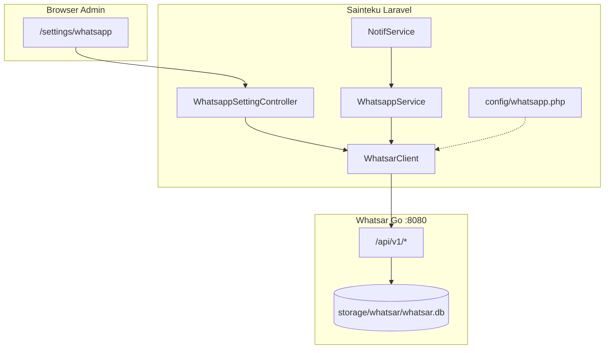
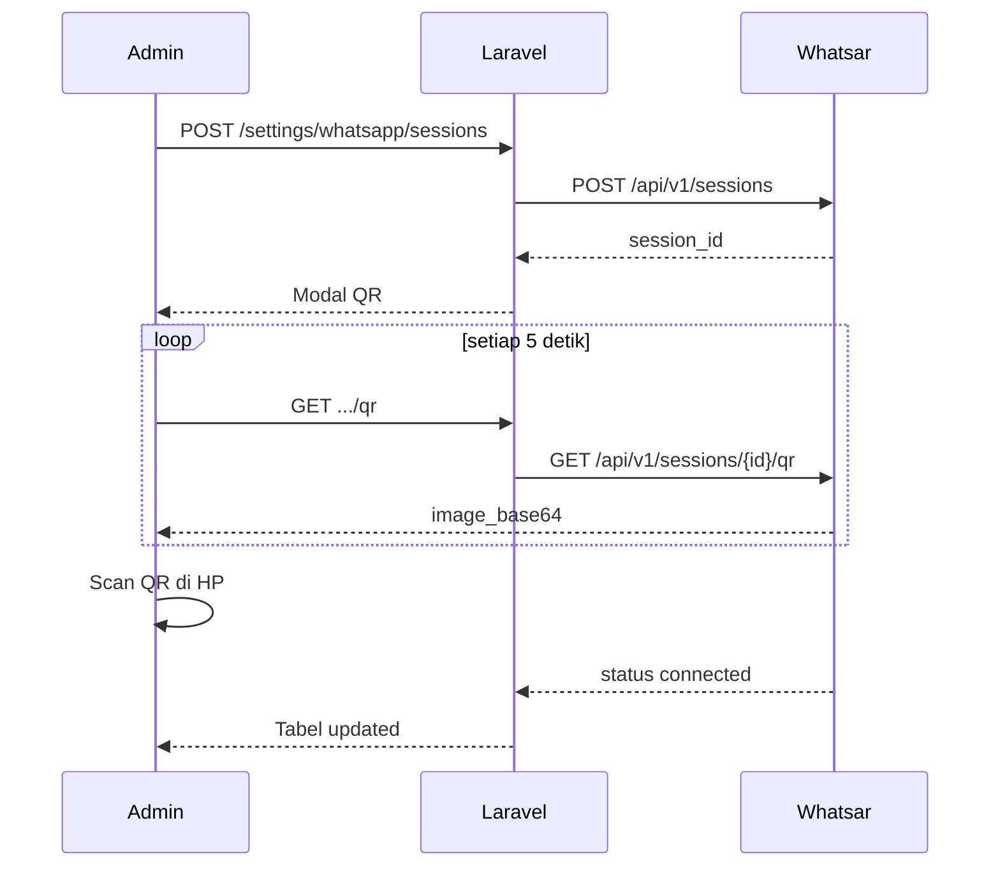

# Plan Implementasi: Whatsar × Sainteku

> Dokumen teknis pendamping [`ROADMAP.md`](./ROADMAP.md).
>
> **Audience:** developer yang mengimplementasi fitur.
>
> **Prinsip:** Whatsar = proses Go terpisah, tapi **tersembunyi** dari admin. Laravel hanya bicara ke `127.0.0.1:8080`.

---

## 1. Arsitektur

### 1.1 Diagram komponen



### 1.2 Struktur folder (target)

```
sainteku/
├── app/
│   ├── Http/Controllers/Settings/
│   │   └── WhatsappSettingController.php      # NEW
│   ├── Services/
│   │   ├── WhatsappService.php                # REFACTOR
│   │   ├── WhatsarClient.php                  # NEW
│   │   └── NotifService.php                   # EXTEND
│   └── Support/
│       └── WhatsappMessageBuilder.php         # NEW (opsional)
├── config/
│   └── whatsapp.php                           # NEW
├── docs/whatsar/
│   ├── ROADMAP.md
│   └── PLAN.md
├── resources/views/settings/whatsapp/           # NEW
│   ├── index.blade.php
│   └── partials/
│       ├── _header.blade.php
│       ├── _sessions_table.blade.php
│       ├── _modal_create.blade.php
│       ├── _qr_panel.blade.php
│       └── _scripts.blade.php
├── routes/web.php                             # ADD routes
├── whatsapp-api/                              # submodule Whatsar (source only)
│   └── .gitkeep → submodule
├── storage/whatsar/                           # runtime data (gitignored)
│   ├── whatsar.db
│   └── logs/
├── deploy/
│   └── whatsar.service                        # NEW systemd unit
└── scripts/
    └── whatsar-install.sh                     # NEW
```

### 1.3 Binding network

| Service | Bind | Akses |
|---------|------|-------|
| Nginx → Laravel | `0.0.0.0:80/443` | Publik |
| Whatsar | `127.0.0.1:8080` | **Hanya localhost** |
| Laravel → Whatsar | `http://127.0.0.1:8080` | Internal HTTP |

Whatsar **tidak** perlu subdomain atau port publik terpisah.

---

## 2. Environment & Konfigurasi

### 2.1 Variabel `.env`

```dotenv
# ── WhatsApp / Whatsar ──────────────────────────
WHATSAPP_DRIVER=whatsar          # whatsar | fonnte | log
WHATSAR_URL=http://127.0.0.1:8080
WHATSAR_API_KEY=                 # auto-generate saat install, jangan di UI
WHATSAR_DATA_DIR=/var/www/sainteku/storage/whatsar
WHATSAR_DEFAULT_SESSION=         # opsional; kosong = random connected
WHATSAPP_ENABLED=true

# Legacy (hapus setelah go-live)
# FONNTE_TOKEN=
```

### 2.2 `config/whatsapp.php`

```php
<?php

return [
    'driver'    => env('WHATSAPP_DRIVER', 'whatsar'),
    'enabled'   => env('WHATSAPP_ENABLED', true),
    'whatsar'   => [
        'url'             => env('WHATSAR_URL', 'http://127.0.0.1:8080'),
        'api_key'         => env('WHATSAR_API_KEY'),
        'default_session' => env('WHATSAR_DEFAULT_SESSION'),
        'timeout'         => 30,
    ],
    'fonnte'    => [
        'token'   => env('FONNTE_TOKEN'),
        'base_url'=> 'https://api.fonnte.com',
    ],
];
```

---

## 3. Layer Service

### 3.1 `WhatsarClient` — HTTP wrapper

**File:** `app/Services/WhatsarClient.php`

**Tanggung jawab:** Semua komunikasi HTTP ke Whatsar. Tidak ada business logic.

| Method | Whatsar endpoint | Keterangan |
|--------|------------------|------------|
| `health()` | `GET /health` | Tanpa API key |
| `listSessions()` | `GET /api/v1/sessions` | |
| `createSession(string $name)` | `POST /api/v1/sessions` | Body: `{name}` |
| `getSession(string $id)` | `GET /api/v1/sessions/{id}` | |
| `getStatus(string $id)` | `GET /api/v1/sessions/{id}/status` | |
| `getQr(string $id)` | `GET /api/v1/sessions/{id}/qr` | Return `image_base64` |
| `deleteSession(string $id)` | `DELETE /api/v1/sessions/{id}` | |
| `sendText(string $sessionId, string $to, string $text, bool $retry = false)` | `POST /api/v1/messages/send` | |

**Header wajib:**

```http
X-API-Key: {WHATSAR_API_KEY}
Content-Type: application/json
```

**Error handling:**

- HTTP 401 → log `UNAUTHORIZED`, jangan expose key ke user
- HTTP 429 → log `RATE_LIMITED`, return false
- HTTP 5xx / connection refused → log, return false (graceful)
- Semua method return `array|null` atau DTO sederhana, **tidak throw** ke controller

### 3.2 `WhatsappService` — refactor

**File:** `app/Services/WhatsappService.php` (existing)

**Perubahan:**

1. Constructor baca `config('whatsapp.driver')`
2. `sendMessage($target, $message)`:
   - `whatsar` → pilih session → `WhatsarClient::sendText()`
   - `fonnte` → logic lama (backward compat sementara)
   - `log` → `Log::info()` saja (dev/test)
3. `pickSession(): ?string`:
   - Jika `WHATSAR_DEFAULT_SESSION` set & connected → pakai itu
   - Else → `listSessions()`, filter `status === 'connected'`, `array_rand()`
4. `formatPhoneNumber()` — **tetap**, sudah benar untuk format `628...`
5. `notifyApproved()` / `notifyRejected()` — **signature tidak berubah**

**Pemanggil existing (jangan ubah controller dulu):**

| File | Method |
|------|--------|
| `Modules/ManajemenAchievement/.../AchievementController.php` | `notifyApproved`, `notifyRejected` |
| `Modules/ManajemenAchievement/.../DosenController.php` | `notifyApproved`, `notifyRejected` |

### 3.3 `NotifService` — extend

**File:** `app/Services/NotifService.php` (existing)

**Konvensi `$data` baru:**

```php
[
    // ... field existing ...
    'send_whatsapp' => true,       // default: false (aktifkan per-modul)
    'whatsapp_text' => '...',      // opsional override
]
```

**Method baru (private):**

```php
private static function dispatchWhatsapp(Collection $users, array $data): void
```

**Alur:**

1. Skip jika `WHATSAPP_ENABLED=false`
2. Skip jika `send_whatsapp === false`
3. Loop user → butuh `phone_number` tidak kosong
4. Build teks dari `WhatsappMessageBuilder` atau `whatsapp_text`
5. `app(WhatsappService::class)->sendMessage($user->phone_number, $text)`
6. try/catch per user — gagal WA tidak ganggu flow

**Hook di method existing:**

Tambahkan `self::dispatchWhatsapp($users, $data)` di akhir:

- `sendToUser()`
- `sendToMany()`
- `sendToRole()`
- `dispatchByRoleIds()`

**Modul kandidat aktivasi `send_whatsapp`:**

| Modul | Trigger | Prioritas |
|-------|---------|-----------|
| MonevAkademik | Pengajuan / approve / revisi soal | Tinggi |
| ManajemenAchievement | Pengajuan prestasi ke approver | Tinggi |
| DocumentRepository | Verifikasi dokumen | Sedang |
| ManajementInfrastruktur | Approve peminjaman | Rendah |

---

## 4. Admin UI — `/settings/whatsapp`

### 4.1 Routes

**File:** `routes/web.php` — dalam group `settings`:

```php
use App\Http\Controllers\Settings\WhatsappSettingController;

Route::get('whatsapp', [WhatsappSettingController::class, 'index'])
    ->name('whatsapp.index');
Route::post('whatsapp/sessions', [WhatsappSettingController::class, 'storeSession'])
    ->name('whatsapp.sessions.store');
Route::delete('whatsapp/sessions/{sessionId}', [WhatsappSettingController::class, 'destroySession'])
    ->name('whatsapp.sessions.destroy');
Route::get('whatsapp/sessions/{sessionId}/qr', [WhatsappSettingController::class, 'qr'])
    ->name('whatsapp.sessions.qr');
Route::get('whatsapp/sessions/{sessionId}/status', [WhatsappSettingController::class, 'status'])
    ->name('whatsapp.sessions.status');
Route::post('whatsapp/test', [WhatsappSettingController::class, 'testSend'])
    ->name('whatsapp.test');
Route::get('whatsapp/health', [WhatsappSettingController::class, 'health'])
    ->name('whatsapp.health');
```

**Route name:** `settings.whatsapp.*` (konsisten dengan `settings.email.*`)

### 4.2 Controller

**File:** `app/Http/Controllers/Settings/WhatsappSettingController.php`

**Guard:** Sama seperti `EmailSettingController` — hanya role `ADM`.

| Action | Behavior |
|--------|----------|
| `index` | List sessions + health banner + status Whatsar service |
| `storeSession` | `POST` name → create session → redirect dengan flash + buka modal QR |
| `destroySession` | Delete session di Whatsar |
| `qr` | JSON: `{ image_base64, status }` — untuk polling Alpine/JS |
| `status` | JSON: `{ status, phone, connected_at }` |
| `testSend` | Kirim pesan uji ke nomor admin yang login |
| `health` | JSON proxy ke `/health` |

**Catatan UX:**

- QR polling setiap **5 detik** sampai `status === 'connected'`, lalu reload tabel
- Tampilkan warning jika `sessions_connected === 0`
- Jangan tampilkan `WHATSAR_API_KEY` di UI

### 4.3 Views

Ikuti pola `resources/views/settings/ai/`:

- Alpine.js (`x-data`) untuk modal & polling
- Tailwind + dark mode
- Partial-based structure
- Icon: `fa-brands fa-whatsapp` (hijau)

**Halaman index berisi:**

1. Health banner (uptime, sessions connected)
2. Tombol "Tambah Session"
3. Tabel: nama, nomor WA, status, dibuat, aksi (QR / hapus)
4. Modal create + panel QR
5. Form test kirim pesan

### 4.4 Menu sidebar

Tambahkan entry di menu Pengaturan Aplikasi (seeder atau `mst_menu`):

| Field | Value |
|-------|-------|
| label | WhatsApp |
| route | `settings.whatsapp.index` |
| icon | `fa-brands fa-whatsapp` |
| parent | Pengaturan Aplikasi |

---

## 5. Deploy & Operasional

### 5.1 Install Whatsar (staging/production)

**Opsi A — Script bundled (disarankan):**

```bash
# Dari root Sainteku
sudo bash scripts/whatsar-install.sh \
  --port 8080 \
  --data-dir /var/www/sainteku/storage/whatsar
```

Script ini:

1. Download binary release GitHub (`arifianilhamnrr/whatsar`)
2. Generate API key → tulis ke `.env` Sainteku (`WHATSAR_API_KEY`)
3. Install systemd unit `deploy/whatsar.service`
4. Set `WHATSAR_DATA_DIR`

**Opsi B — Submodule + build manual (dev):**

```bash
git submodule add https://github.com/arifianilhamnrr/whatsar.git whatsapp-api
cd whatsapp-api && make build
./bin/whatsar-server --port 8080 --data-dir ../storage/whatsar
```

### 5.2 Systemd unit

**File:** `deploy/whatsar.service`

```ini
[Unit]
Description=Whatsar WhatsApp Gateway for Sainteku
After=network.target

[Service]
Type=simple
User=www-data
WorkingDirectory=/var/www/sainteku
EnvironmentFile=/var/www/sainteku/.env
ExecStart=/usr/local/bin/whatsar-server \
  --port 8080 \
  --bind 127.0.0.1 \
  --data-dir /var/www/sainteku/storage/whatsar
Restart=on-failure
RestartSec=5

[Install]
WantedBy=multi-user.target
```

### 5.3 `.gitignore` additions

```
/storage/whatsar/
whatsapp-api/bin/
```

### 5.4 Backup

| Asset | Frekuensi | Cara |
|-------|-----------|------|
| `storage/whatsar/whatsar.db` | Harian | rsync / snapshot VPS |
| `.env` (`WHATSAR_API_KEY`) | Saat rotate | Secret manager / offline |

Tanpa `whatsar.db`, admin harus scan QR ulang semua session.

---

## 6. Mapping API Whatsar

Referensi lengkap: [API.md](https://github.com/arifianilhamnrr/whatsar/blob/main/API.md)

### 6.1 Kirim pesan (core)

```http
POST /api/v1/messages/send
X-API-Key: {key}
Content-Type: application/json

{
  "session_id": "uuid-v4",
  "to": "6281234567890",
  "text": "Pesan notifikasi",
  "retry": true
}
```

### 6.2 Session lifecycle (admin UI)



### 6.3 Rate limit

- 60 request/menit per API key
- Untuk burst notif (mis. 20 user sekaligus): set `retry: true` di payload atau throttle di Laravel (`sleep` / queue job)

---

## 7. Testing

### 7.1 Unit tests

**File:** `tests/Unit/WhatsarClientTest.php`

- Mock `Http::fake()` untuk tiap endpoint
- Assert header `X-API-Key` terkirim
- Assert graceful pada 401, 429, 500

**File:** `tests/Unit/WhatsappServiceTest.php`

- `pickSession()` dengan 0, 1, N session connected
- Driver `log` tidak hit HTTP

### 7.2 Feature tests

**File:** `tests/Feature/Settings/WhatsappSettingTest.php`

- Non-admin → 403
- Admin → index 200
- `storeSession` → mock WhatsarClient

### 7.3 Manual UAT checklist

- [ ] Whatsar service running (`systemctl status whatsar`)
- [ ] `/settings/whatsapp` accessible oleh ADM
- [ ] Buat session baru, QR muncul
- [ ] Scan QR, status jadi `connected`, nomor WA tampil
- [ ] Test kirim pesan ke nomor sendiri
- [ ] Approve prestasi mahasiswa → WA terkirim
- [ ] Reject prestasi → WA terkirim dengan catatan
- [ ] Restart Whatsar → session tetap connected (DB persist)
- [ ] Reboot VPS → Whatsar auto-start, session tetap connected
- [ ] Matikan Whatsar → approve prestasi tetap sukses (WA gagal di log saja)

---

## 8. Urutan PR (disarankan)

Implementasi dipecah supaya reviewable:

| PR | Scope | Files utama |
|----|-------|-------------|
| PR-1 | Infra: submodule, systemd, install script, config | `deploy/`, `scripts/`, `config/whatsapp.php`, `.env.example` |
| PR-2 | `WhatsarClient` + refactor `WhatsappService` + tests | `app/Services/` |
| PR-3 | Admin UI `/settings/whatsapp` | Controller, views, routes, menu |
| PR-4 | `NotifService` + aktivasi modul | `NotifService.php`, modul controllers |
| PR-5 | Hapus Fonnte, docs operasional, go-live | cleanup, runbook |

---

## 9. Rollback Plan

| Kondisi | Aksi |
|---------|------|
| Whatsar down di production | Set `WHATSAPP_DRIVER=log` → notif tetap in-app/email |
| Perlu Fonnte sementara | Set `WHATSAPP_DRIVER=fonnte` + `FONNTE_TOKEN` |
| Session logout massal | Admin buka `/settings/whatsapp` → scan QR ulang |
| API key bocor | Regenerate di Whatsar + update `.env` + reload systemd |

---

## 10. Checklist Pre-Implement (developer)

Sebelum coding PR-1:

- [ ] Baca [`ROADMAP.md`](./ROADMAP.md) — pahami fase
- [ ] Clone Whatsar lokal, jalankan manual, kirim 1 pesan via curl
- [ ] Pastikan staging punya Go binary atau gunakan release prebuilt
- [ ] Konfirmasi path deploy production (`/var/www/sainteku` atau lain)
- [ ] Siapkan nomor WA khusus untuk session notifikasi (bukan nomor pribadi penting)

---

## 11. Referensi Kode Existing

| File | Relevan karena |
|------|----------------|
| `app/Services/WhatsappService.php` | Service WA saat ini (Fonnte) |
| `app/Services/NotifService.php` | Pusat notifikasi in-app + email |
| `app/Http/Controllers/Admin/EmailSettingController.php` | Pola guard ADM + CRUD settings |
| `app/Http/Controllers/Settings/AiSettingController.php` | Pola settings dengan modal Alpine |
| `resources/views/settings/email/index.blade.php` | Template UI settings |
| `routes/web.php` L72–111 | Konvensi route `/settings/*` |