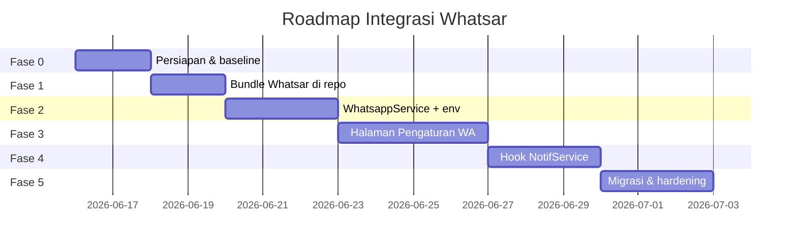

# Roadmap: Integrasi Whatsar ke Sainteku

> **Tujuan:** Whatsar jadi bagian bawaan Sainteku — satu deploy, satu panel admin, tanpa Fonnte.
>
> **Repo Whatsar:** https://github.com/arifianilhamnrr/whatsar
>
> **Status:** Draft — siap dieksekusi
>
> **Estimasi total:** 3–4 minggu (1 developer, part-time) atau 1–1,5 minggu (full-time)

---

## Ringkasan

| Aspek | Sebelum | Sesudah |
|-------|---------|---------|
| Provider WA | Fonnte (cloud, `FONNTE_TOKEN`) | Whatsar (self-hosted, lokal) |
| Kelola session | Manual di dashboard Fonnte | `/settings/whatsapp` di Sainteku |
| Notifikasi prestasi | `WhatsappService` → Fonnte | `WhatsappService` → Whatsar API |
| Notifikasi modul lain | Hanya in-app + email (`NotifService`) | + opsi WhatsApp |
| Deploy | Laravel saja | Laravel + proses Whatsar (systemd) |

---

## Fase Overview



---

## Fase 0 — Persiapan & Baseline

**Durasi:** 1–2 hari  
**Goal:** Semua stakeholder sepakat scope, environment siap, tidak ada blocker infrastruktur.

### Deliverables

- [ ] Dokumen ini (`ROADMAP.md`) dan `PLAN.md` disetujui tim
- [ ] VPS/staging punya RAM ≥ 1 GB (ideal 2 GB+) untuk Laravel + 1 session Whatsar
- [ ] Port `8080` internal tersedia (bind `127.0.0.1`, tidak perlu publik)
- [ ] Baseline: catat semua pemanggil `WhatsappService` dan `NotifService` (sudah teridentifikasi di PLAN)

### Kriteria selesai

- Staging environment bisa diakses admin
- `.env` staging punya placeholder `WHATSAR_URL`, `WHATSAR_API_KEY`

---

## Fase 1 — Bundle Whatsar di Monorepo

**Durasi:** 1–2 hari  
**Goal:** Whatsar hidup di dalam repo Sainteku, bisa di-start otomatis saat deploy.

### Deliverables

- [ ] Submodule / copy source ke `whatsapp-api/` (folder sudah ada, masih kosong)
- [ ] Script `scripts/whatsar-install.sh` — wrap `install.sh` Whatsar dengan path Sainteku
- [ ] Systemd unit `deploy/whatsar.service` — start/stop/restart
- [ ] Data dir: `storage/whatsar/` (DB, logs) — di `.gitignore`
- [ ] Health check: `GET /health` dari Laravel atau script deploy

### Kriteria selesai

```bash
curl -s http://127.0.0.1:8080/health
# → {"success":true,"data":{"status":"ok",...}}
```

- Whatsar auto-restart via systemd setelah reboot VPS
- Binary tidak di-commit; CI/deploy download release GitHub

---

## Fase 2 — WhatsappService → Whatsar API

**Durasi:** 2–3 hari  
**Goal:** Ganti backend Fonnte ke Whatsar tanpa mengubah interface publik service.

### Deliverables

- [ ] Refactor `app/Services/WhatsappService.php`
  - Panggil `POST /api/v1/messages/send`
  - Header `X-API-Key`
  - Session picker: random dari session `connected`
- [ ] Config `config/whatsapp.php` + env vars
- [ ] `WhatsarClient` — thin HTTP wrapper (health, sessions, send, qr)
- [ ] Backward compat: `notifyApproved()`, `notifyRejected()` tetap sama
- [ ] Feature flag `WHATSAPP_DRIVER=whatsar|fonnte|log` untuk rollback

### Kriteria selesai

- Approve/reject prestasi di **ManajemenAchievement** kirim WA via Whatsar
- Log jelas jika tidak ada session connected (graceful fail, tidak block flow utama)
- Unit test mock HTTP untuk `WhatsarClient`

---

## Fase 3 — Halaman Pengaturan WhatsApp

**Durasi:** 3–4 hari  
**Goal:** Admin kelola session, scan QR, lihat status — tanpa buka dashboard Whatsar terpisah.

### Deliverables

- [ ] Route `/settings/whatsapp` (mengikuti pola `/settings/email`, `/settings/ai`)
- [ ] `WhatsappSettingController` — proxy ke Whatsar API
- [ ] Views: daftar session, modal tambah session, QR polling, hapus session
- [ ] Menu sidebar: **Pengaturan Aplikasi → WhatsApp**
- [ ] Badge status: `connected` / `disconnected` / `qr_pending`
- [ ] Tombol "Kirim pesan uji" ke nomor admin

### Kriteria selesai

- Admin bisa tambah session baru + scan QR dari browser Sainteku
- Session connected muncul di tabel dengan nomor WA terpasang
- Hanya role `ADM` yang bisa akses (sama seperti email/AI settings)

---

## Fase 4 — Integrasi NotifService

**Durasi:** 2–3 hari  
**Goal:** Semua notifikasi aplikasi bisa opsional kirim WhatsApp, konsisten dengan email.

### Deliverables

- [ ] Extend konvensi `$data` di `NotifService`:
  - `send_whatsapp` => `true|false` (default `false` di fase awal)
  - `whatsapp_text` => override pesan (opsional)
- [ ] `dispatchWhatsapp()` — mirror pola `dispatchEmails()`
- [ ] Template pesan WA ringkas dari field `action`, `item_name`, `type`, `url`
- [ ] Aktifkan `send_whatsapp` di modul prioritas:
  - MonevAkademik (review soal)
  - ManajemenAchievement (pengajuan prestasi)
  - DocumentRepository (verifikasi dokumen)
- [ ] User harus punya `phone_number` terisi & tervalidasi

### Kriteria selesai

- Notif in-app + email + WA terkirim untuk minimal 1 flow end-to-end (mis. kaprodi review soal)
- Gagal WA tidak membatalkan notif in-app/email (try/catch + log)

---

## Fase 5 — Migrasi, Hardening & Go-Live

**Durasi:** 2–3 hari  
**Goal:** Production-ready, aman, terdokumentasi operasional.

### Deliverables

- [ ] Hapus / deprecate `FONNTE_TOKEN` dari `.env.example`
- [ ] Runbook operasional: restart Whatsar, rotate API key, backup `whatsar.db`
- [ ] Monitoring: alert jika `/health` gagal atau `sessions_connected = 0`
- [ ] Rate limit awareness (60 req/menit per API key)
- [ ] Logrotate untuk log Whatsar
- [ ] UAT checklist (lihat PLAN.md § Testing)
- [ ] Deploy production + smoke test

### Kriteria selesai

- Production tidak pakai Fonnte
- Minimal 1 session WA connected & stabil 48 jam
- Rollback plan terdokumentasi (`WHATSAPP_DRIVER=fonnte` atau `log`)

---

## Milestone Checklist

| # | Milestone | Target | Status |
|---|-----------|--------|--------|
| M1 | Whatsar jalan di staging | Fase 1 | ⬜ |
| M2 | Prestasi approve/reject via Whatsar | Fase 2 | ⬜ |
| M3 | Admin UI session + QR | Fase 3 | ⬜ |
| M4 | NotifService + WA di 1 modul | Fase 4 | ⬜ |
| M5 | Production go-live | Fase 5 | ⬜ |

---

## Risiko & Mitigasi

| Risiko | Dampak | Mitigasi |
|--------|--------|----------|
| Session WA logout / banned | Notif gagal | Multi-session + random picker; alert admin |
| RAM VPS tipis | Whatsar OOM | `--with-swap` di install; max 2–3 session |
| QR expired | Admin bingung | Auto-refresh QR di UI (polling 5 detik) |
| Rate limit 60/min | Burst notif gagal | Queue retry Whatsar (`retry: true`) atau throttle Laravel |
| Fonnte masih dipakai saat transisi | Duplikat / konflik | Feature flag `WHATSAPP_DRIVER` |

---

## Out of Scope (v1)

Hal berikut **tidak** masuk roadmap awal — bisa fase berikutnya:

- Webhook pesan masuk (`POST /api/v1/webhooks`) — chatbot / auto-reply
- Docker Compose all-in-one (bisa ditambah setelah systemd stabil)
- Multi-tenant Whatsar untuk banyak instansi Sainteku
- Panel Whatsar native (`/admin`) — diganti full oleh Sainteku settings
- Kirim gambar/dokumen dari modul prestasi

---

## Referensi

- Detail teknis: [`PLAN.md`](./PLAN.md)
- API Whatsar: https://github.com/arifianilhamnrr/whatsar/blob/main/API.md
- Contoh PHP: https://github.com/arifianilhamnrr/whatsar/blob/main/examples/php/send-notif.php